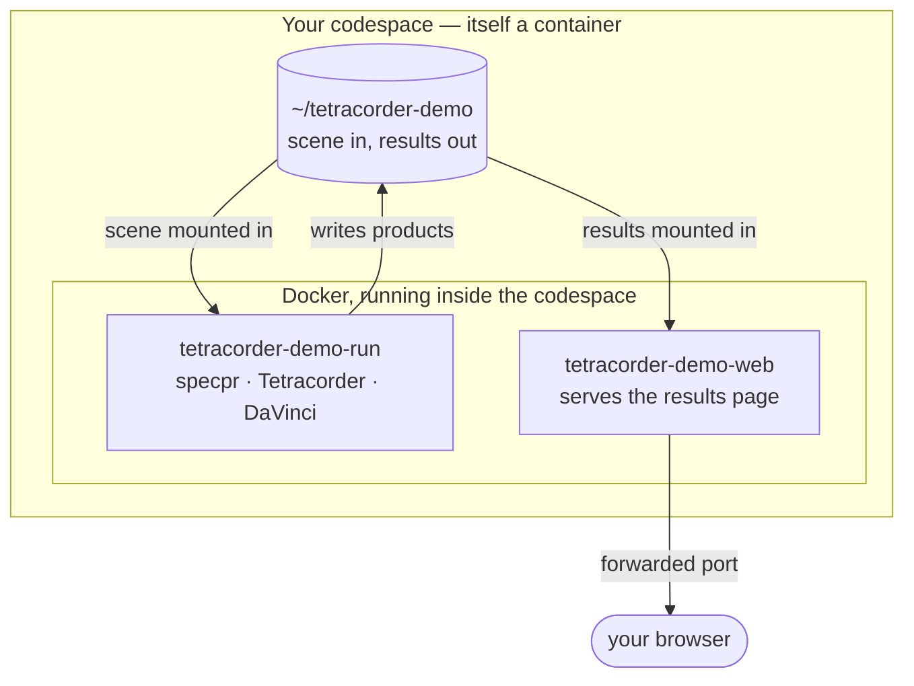

# Tetracorder in a codespace

You are inside a **container**. So is everything this demo runs. That is the
whole trick, and it is worth two minutes before you start.

## What a container actually is

A container is a packaged filesystem plus a process — not a virtual machine.
There is no second operating system booting underneath; the processes inside
share this machine's kernel and simply cannot see anything outside their own
packaged filesystem.

Two words worth keeping apart:

| | |
|---|---|
| **image** | a read-only snapshot of a filesystem: the programs, libraries and data, already built |
| **container** | one running instance of an image, with its own isolated view of the world |

You can start ten containers from one image and they will not disturb each
other. Delete a container and the image is untouched.

**Why that matters here.** Tetracorder is not a program you `pip install`. It is
Fortran and ratfor compiled against `specpr`, driven by shell scripts, alongside
DaVinci and a Python environment — decades of accumulated build steps that are
genuinely unpleasant to reproduce. The image has all of it compiled already, so
this demo *downloads* a working Tetracorder instead of building one.

## What is running in here



In words: the codespace you are typing in is a container. Inside it runs a
Docker daemon, and this demo starts two more containers from the Tetracorder
image — one that does the science and exits, one that serves the results page
and stays up. The scene goes in and the mineral products come out through
directories mounted from the codespace, which is why the results survive after
the run container is gone.

That also means you can watch it happen:

```
docker ps                              # the containers that exist right now
docker logs -f tetracorder-demo-run    # the run, live
```

## Now run it

```
.devcontainer/get-started.sh
```

It takes one step at a time — fetch the image, fetch a sample scene, run
Tetracorder, open the results — and tells you what each one does before it does
it. Nothing has been started for you.

A full run is about nine minutes. That cost is almost entirely fixed: Tetracorder
emits roughly 2,400 mineral products whatever the scene size, so the 100×100
window is not what makes it slow.

> Stopping a codespace terminates every running process but keeps your files, so
> a run interrupted half way is normal rather than broken. `.devcontainer/get-started.sh`
> notices and offers to start it again.
